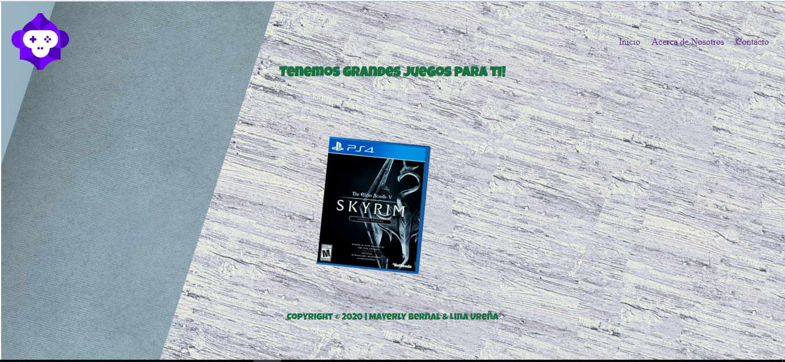
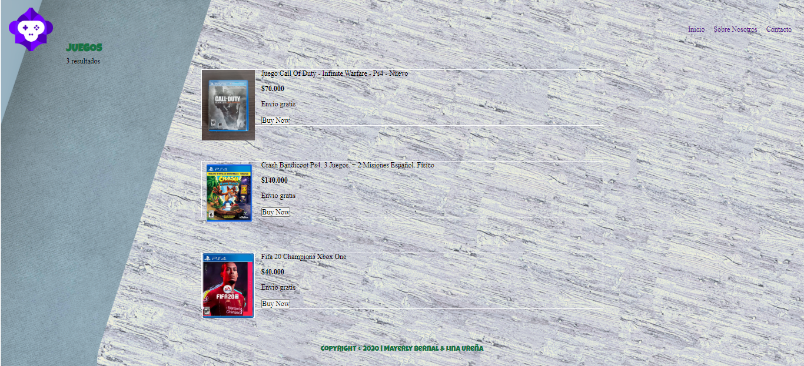
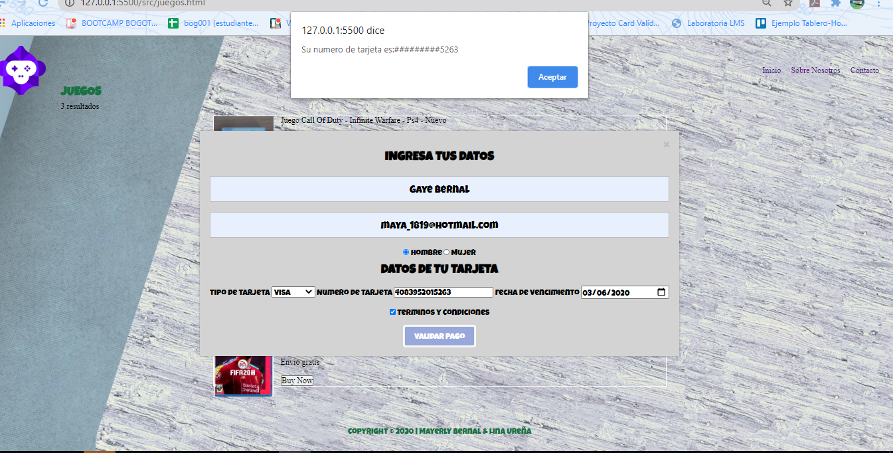
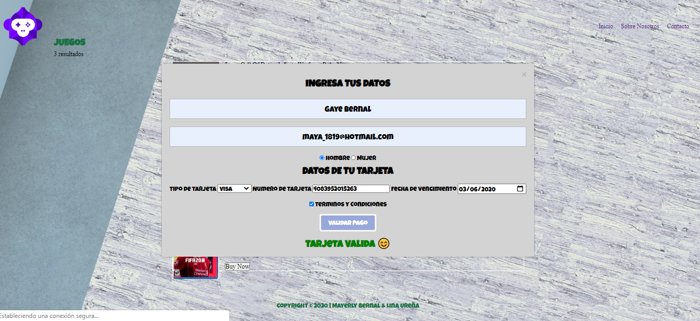
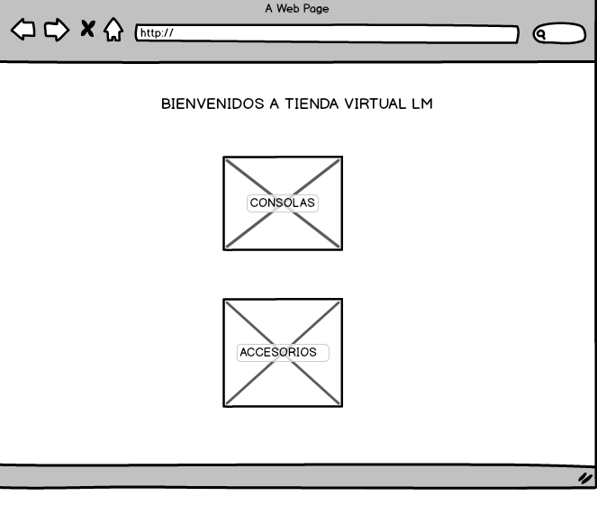
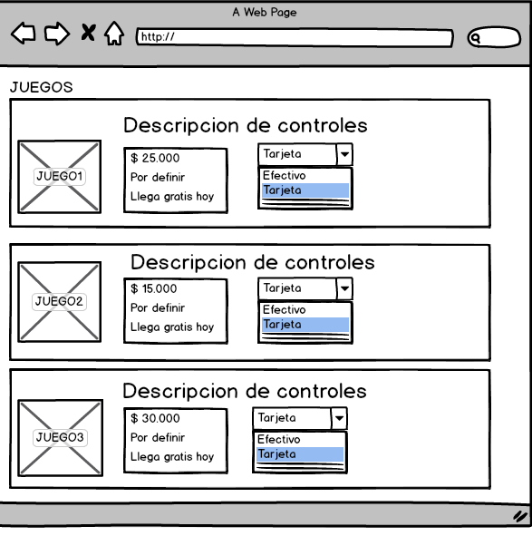
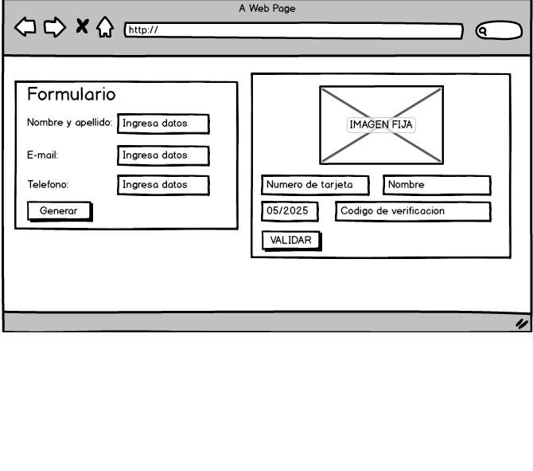

# The astronaut Dog - Gamer shop

## Índice

- [The astronaut Dog - Gamer shop](#the-astronaut-dog---gamer-shop)
  - [Índice](#índice)
  - [1. Preámbulo](#1-preámbulo)
  - [2. Resumen del desarrollo del proyecto](#2-resumen-del-desarrollo-del-proyecto)
  - [3. Archivos que encontrarás en el repositorio](#3-archivos-que-encontrarás-en-el-repositorio)
    - [HTML](#html)
    - [JavaScript](#javascript)
    - [CSS](#css)
    - [README](#readme)
    - [Recursos visuales](#recursos-visuales)
  - [4. Look final del proyecto](#4-look-final-del-proyecto)
  - [5. Investigación UX](#5-investigación-ux)
    - [Sketch inicial](#sketch-inicial)
    - [Imagen del prototipo final](#imagen-del-prototipo-final)
  - [5. Planning del proyecto](#5-planning-del-proyecto)
  - [6. Objetivos de aprendizaje](#6-objetivos-de-aprendizaje)
    - [UX](#ux)
    - [HTML y CSS](#html-y-css)
    - [DOM](#dom)
    - [Javascript](#javascript-1)
    - [Testing](#testing)
    - [Git y GitHub](#git-y-github)
    - [Buenas prácticas de desarrollo](#buenas-prácticas-de-desarrollo)

## 1. Preámbulo

Este es el primer proyecto que desarrollamos en el Bootcamp de [Laboratoria], propusimos una tienda virtual para gamers, el objetivo principal de este proyecto es validar la tarjeta con la que el usuario va a comprar el producto, ésto por medio del [algoritmo de Luhn].
Además, luego de digitar su número de tarjeta se verifica al usuario con los últimos cuatro dígitos enmascarados para su seguridad.

## 2. Resumen del desarrollo del proyecto

Tras leer el [README] hicimos un sketch en papel, se llevó a cabo una sesión de feedback donde tuvimos la oportunidad de hacer mejoras prontas al prototipo inicial.
Luego, forkeamos el proyecto base, lo desarrollamos localmente, desarrollamos la estructura básica en html, luego nos enfocamos en JavaScript mientras generabamos recursos visuales e interactuábamos con CSS.

## 3. Archivos que encontrarás en el repositorio

### HTML

 | Archivo     | Descripción                   |
 | :---------- | :---------------------------- |
 | index.html  | Página principal de la tienda |
 | juegos.html | Categoría de Juegos           |

### JavaScript

| Archivo      | Descripción                                                                               |
| :----------- | :---------------------------------------------------------------------------------------- |
| validador.js | Funcionalidad de validar la tarjeta y enmascarar los últimos cuatro números de la tarjeta |

### CSS

| Archivo   | Descripción                 |
| :-------- | :-------------------------- |
| style.css | Estilos del proyecto global |

### README

| Archivo   | Descripción                                                 |
| :-------- | :---------------------------------------------------------- |
| readme.md | Información general del proyecto y objetivos de aprendizaje |

### Recursos visuales

| Carpeta  | Descripción                                                     |
| :------- | :-------------------------------------------------------------- |
| Imagenes | Carpeta con material visual utilizado en el cuerpo del proyecto |

## 4. Look final del proyecto

## 5. Investigación UX

### Sketch inicial

### Imagen del prototipo final

## 5. Planning del proyecto

Utilizamos [Trello] como herramienta de coordinación para el óptimo desarrollo del proyecto, para verlo da click [aquí](https://trello.com/b/15hGsGWG/validador).

## 6. Objetivos de aprendizaje

Trabajando en parejas aprenderán a construir una aplicación web que interactuará
con lx usuarix final a través del navegador, utilizando HTML, CSS y JavaScript
como tecnologías.

Reflexiona y luego marca los objetivos que has llegado a **entender** y
**aplicar** en tu proyecto.

### UX

* [x]  Diseñar la aplicación pensando y entendiendo al usuario
* [x]  Crear prototipos para obtener feedback e iterar
* [ ]  Aplicar los principios de diseño visual

### HTML y CSS

* [ ]  Uso correcto de HTML semántico
* [x]  Uso de selectores de CSS
* [ ]  Construir tu aplicación respetando el diseño realizado (maquetación).

### DOM

* [x]  Uso de selectores de nodos del DOM
* [x]  Manejo de eventos del DOM
* [x]  Manipulación dinámica del DOM

### Javascript

* [x]  Manipulación de strings
* [x]  Uso de condicionales
* [x]  Uso de bucles
* [ ]  Uso de funciones
* [ ]  Datos atómicos y estructurados
* [ ]  Utilizar ES Modules (`import` | `export`).

### Testing

* [ ] [Testeo de tus funciones]

### Git y GitHub

* [x]  Comandos de git (`add` | `commit` | `pull` | `status` | `push`).
* [x]  Manejo de repositorios de GitHub (`clone` | `fork` ).
* [ ] Manejo de repositorios de GitHub  (`gh-pages`).

### Buenas prácticas de desarrollo,

* [ ]  Organizar y dividir el código en módulos (Modularización).
* [x]  Uso de identificadores descriptivos (Nomenclatura | Semántica).
* [ ]  Uso de linter para seguir buenas prácticas (ESLINT).